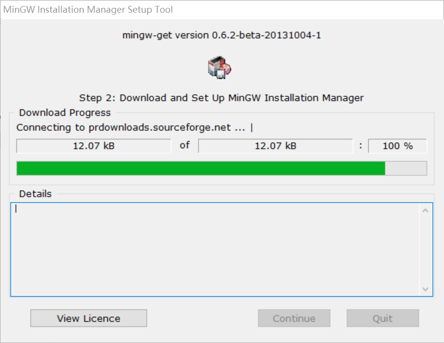
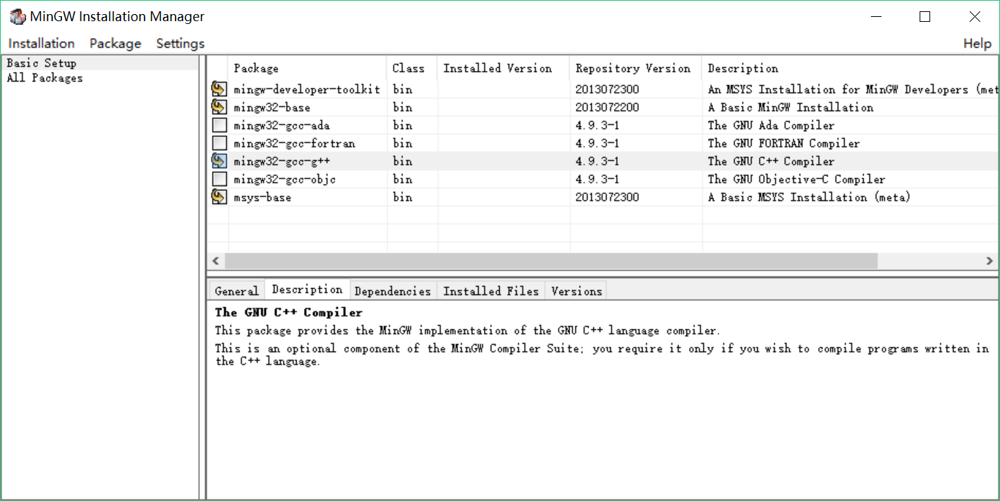
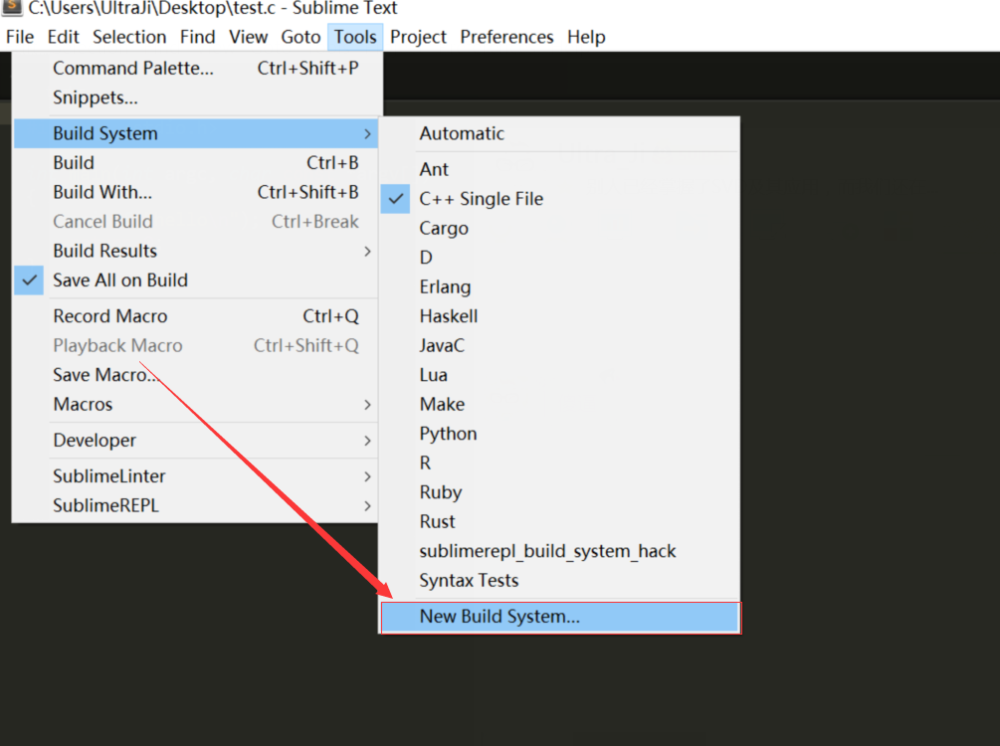
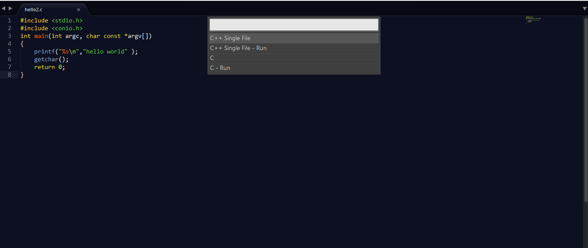
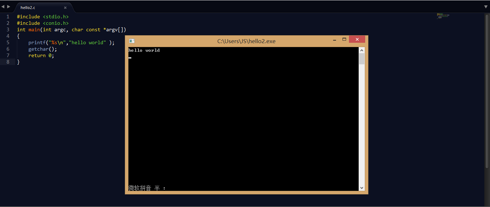

# C语音程序开发环境搭建

## 安装sublime

## 安装MinGW

[MinGW下载地址](http://www.mingw.org/)

- 安装MinGW Installer



- 打开MinGW Installer Manger 安装应用



- 配置环境变量
``` - C_INCLUDEDE_PATH   C:\MinGW\include 
    - LIBRARY_PATH       C:\MinGW\lib 
    - Path               C:\MinGW\bin
```

## 配置sublime

**C.sublime-build**



内容如下
```
{
    "cmd": ["gcc", "${file}", "-o", "${file_path}/${file_base_name}"],
    "file_regex": "^(..[^:]*):([0-9]+):?([0-9]+)?:? (.*)$",
    "working_dir": "${file_path}",
    "selector": "source.c",
     "shell": true,
    "variants":
    [
       {
            "name": "Run",
            "cmd": ["gcc", "${file}", "-o", "${file_path}/${file_base_name}","&", "start", "${file_path}/${file_base_name}.exe"]
       }
    ]
}
```

- path就是Cygwin或Mingw的bin目录。
- cmd是一串命令，当Ctrl+B编译时会触发。
- selector的作用就是，当Tools->Build System是Automatic时，根据当前源文件的后缀名决定是否触发当前Build System。我们想只用Cygwin的GCC处理C，那么就写成source.c就可以了。
- variants的name会添加到Tools->Build System菜单下。利用start运行生成的exe

写一个hello.c的程序
```
#include <stdio.h>
#include <conio.h>
int main(int argc, char const *argv[])
{
    printf("%s\n","hello world" );
    getchar();
    return 0;
}
```

**使用_Ctrl+Shift+B_选择编译工具_C_编译运行**
- 使用_C_进行编译
- 使用_C-RUN_进行编译并运行



结果如下：


##配置其他插件

